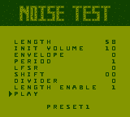

# Game Boy Noise Test

Implementing the Game Boy's Audio Processing Unit (APU) is one of the most challenging parts when developing a Game Boy emulator.
Particularly, because debugging is hard and you may not want to create an exact replica, but something that simulates fast and sounds good enough.
The _Game Boy Noise Test_ supports you in this process, allowing you to test features of the noise channel and evaluate their acoustical impressions.

## Usage

Open `noise_test.gb` with your Game Boy emulator.
After the boot, you arrive at the following user interface:

It allows you to modify all noise-channel-related settings:

| Name   | Address | Bits        | Function                                             |
|--------|---------|-------------|------------------------------------------------------|
| NR41   | 0xFF20  | `--LL LLLL` | Length load                                          |
| NR42   | 0xFF21  | `VVVV APPP` | Starting volume, envelope add mode, period           |
| NR43   | 0xFF22  | `SSSS WDDD` | Clock shift, width mode of LFSR, divisor code        |
| NR44   | 0xFF23  | `TL-- ----` | Trigger, length enable                               |

Values can be changed by selecting them and pressing left or right on the D-pad.
Once content with the configuration, move the cursor to "PLAY" and press A.
By pressing SELECT you can also switch between the following predefined settings:

| Preset | Description                                                       |
|--------|-------------------------------------------------------------------|
| 0      | Empty preset                                                      |
| 1      | Hi-hat from Tetris                                                |
| 2      | Snare from Tetris                                                 |
| 3      | Fading in wave from The Legend Of Zelda: Link's Awakening         |
| 4      | Fading out wave from The Legend Of Zelda: Link's Awakening        |
| 5      | Fading in snare                                                   |
| 6      | Bombshell Koopa (Nokobon) explosion from Super Mario Land         |
| 7      | Explosion                                                         |
| 8      | Chiptune-like Explosion                                           |
| 9      | First noise part of defeating a Fighter Fly from Super Mario Land |

## Building

In `src/noise_test.asm` you find the source code of the Game Boy Noise Test.
Assuming [RBGDS](https://github.com/gbdev/rgbds) is installed, it can be built with a simple `make`.
